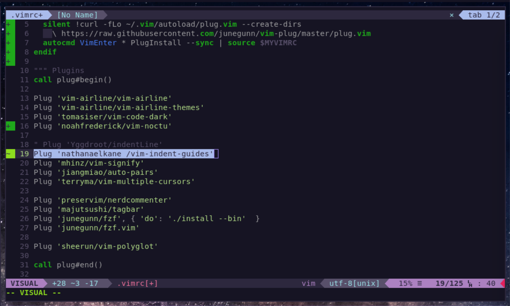

# vim-noctu-airline

### A 16-color vim-airline theme

This [vim-airline](https://github.com/vim-airline/vim-airline) theme uses the terminal's 16 ANSI colors to style the airline and tabline. This theme ports [noahfrederick's vim-noctu theme](https://github.com/noahfrederick/vim-noctu) to vim airline, in order to synchronize the status line theme with the editor theme.

### Example

Example of vim-noctu-airline and vim-noctu in a kitty terminal using the [Grape theme](https://github.com/dexpota/kitty-themes).


### Installation

To install the plugin, copy `autoload` directory to your `.vim` directory.

#### Using vim-plug:

```
Plug 'blazingbbq/vim-noctu-airline'
```
